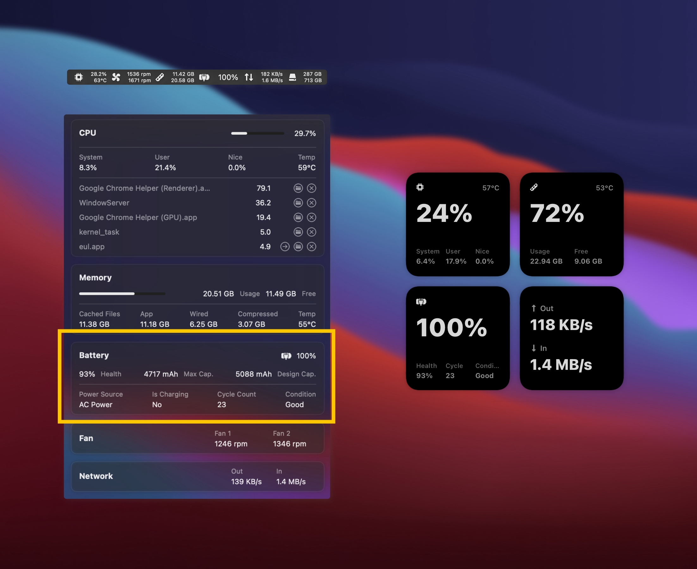

# BatteryMenuBlockView.swift

[permalink](https://github.com/gao-sun/eul/blob/adef12536fba626a2a7d00ab2c295eff1cabbf9a/eul/Views/Menu/BatteryMenuBlockView.swift)

This file is responsible for the battery menu block in the eul Mac app,
highlighted in the screenshot below. It's written using SwiftUI, a new framework
from Apple for building reactive UI.

